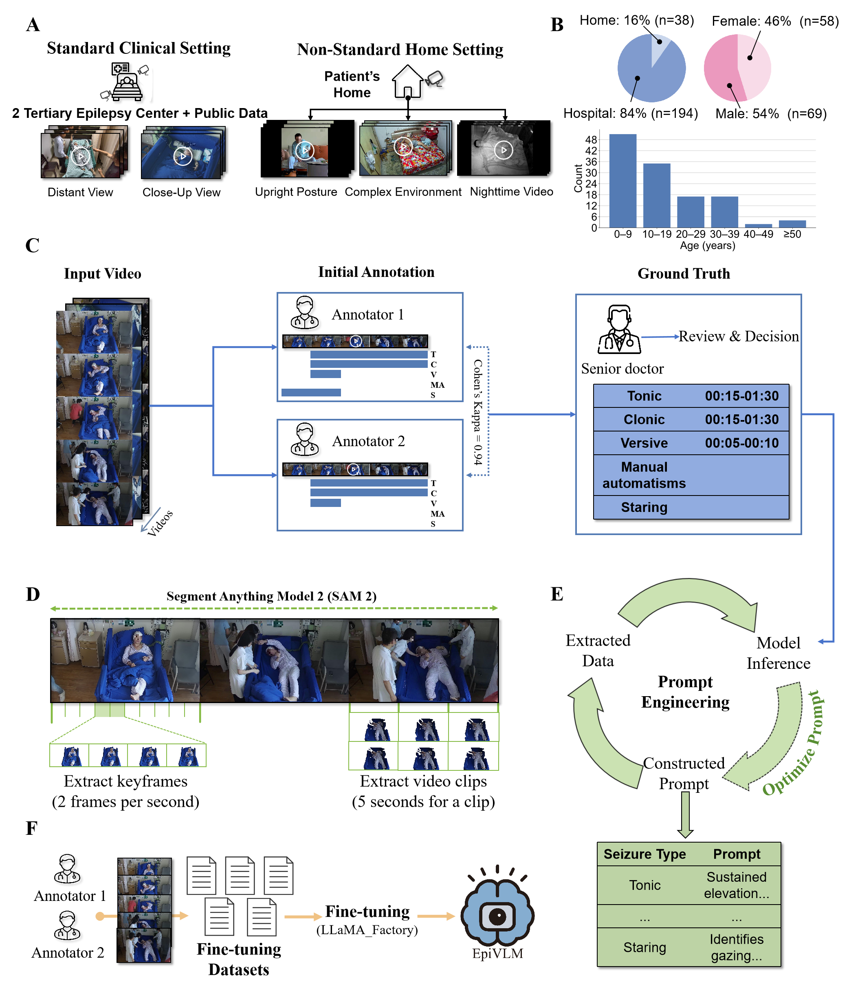

# EpiVLMs: A Multimodal Vision–Language Model System for Fast Seizure Detection and Classification Across Clinical and Home Environments

  
  
  
  
  
  
  

---

## Overview

### Problem
Many epileptic seizures occur outside specialist supervision and remain under-recognized. Inpatient video-EEG is resource-intensive; outpatient/smartphone videos still need manual review, which is slow and difficult to scale.

### Highlights (What’s new in this work)
- **VLM pipeline for five semiologies**: tonic, clonic, versive, manual automatisms, and staring, covering both **clinical** and **home** environments.
- **Patient-centric visual focus**: SAM2 is used to extract patient silhouettes, reducing background distraction and improving robustness in cluttered scenes.
- **Symptom-aware prompting**: concise, clinically grounded prompts tailored to each semiology; outputs standardized for evaluation.
- **Hybrid inputs**: static frames for *staring*; overlapping short video clips for motor semiologies to capture temporal dynamics.
- **Per-symptom fine-tuning**: five independent models, improving sensitivity/specificity over prompt-only inference.
- **Timeliness & stability**: sub-6-second mean detection latency (internal) and high run-to-run agreement; video-level false detection rate remains low on an independent check.

---

## Workflow

  

**Stages**
1. **Data & Annotation** — EMU + home videos; dual-neurologist labels; senior adjudication.
2. **Segmentation & Prompts** — SAM2 patient silhouette extraction; symptom-aware prompt templates.
3. **Fine-Tuning & Evaluation** — per-symptom datasets; held-out evaluation; latency & stability checks.

---

## Figure 5 — Potential Clinical Applications

> Replace the path below with your Figure 5 image showing future application directions.

  

**Directions**
- **Remote monitoring & early alerts:** near-real-time monitoring in home or resource-limited settings.  
- **Onset-order–assisted localization:** combine symptom onset sequences with clinical context to support presurgical planning.  
- **Automated typing & workflow support:** structured outputs for EHR integration, follow-up, and research data pipelines.  
- **Scalable deployment:** adaptable to multi-center collaboration and cost-effective hardware.

---

## Environment

- **OS:** Ubuntu 20.04.6  
- **Python:** 3.10.16  
- **PyTorch:** 2.5.1  
- **Transformers:** 4.51.3  
- **GPUs:** 3 × NVIDIA A100-PCIE-40GB

**Referenced Repositories**
- Qwen2.5-VL: https://github.com/QwenLM/Qwen2.5-VL  
- LLaMA-Factory: https://github.com/hiyouga/LLaMA-Factory

---

## Data Availability

The video dataset contains sensitive patient information and is **not publicly available** due to ethical and privacy considerations.  
Access may be considered **upon reasonable request** and **IRB/ethics approval**.

- **Contact:** *Lei Chen* — *leilei_25@126.com*  
- Please include affiliation, IRB approval details, and a brief data-use plan.

---

## Citation

If this repository informs your research, please cite:

