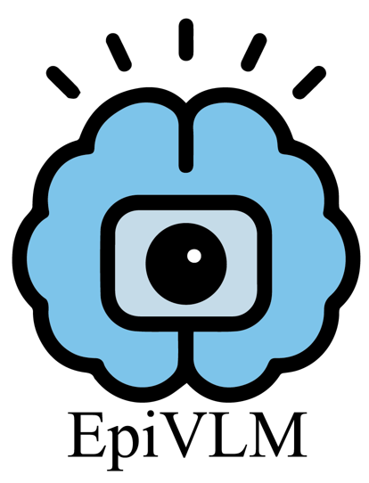

<p align="center">
  
</p>

# EpiVLMs: A Multimodal Vision–Language Model System for Fast Seizure Detection and Classification Across Clinical and Home Environments

<p align="center">
  
  
  
  
  
  
  
</p>


---

## Overview

## Repository Map
```
│ LICENSE
│ README.md
│
├─assets
│ workflow.png
│ validation-furture work.png
| logo.png
│
├─code
│ frame_extract.py
│ Model Inference.py
│ videoclip.py
│
├─fine-tuning data
│ example.json
│
└─prompt
all-prompt.docx
```

### Highlights
- **VLM pipeline for five semiologies**: tonic, clonic, versive, manual automatisms, and staring, covering both **clinical** and **home** environments.
- **Patient-centric visual focus**: SAM2 is used to extract patient silhouettes, reducing background distraction and improving robustness in cluttered scenes.
- **Symptom-aware prompting**: concise, clinically grounded prompts tailored to each semiology; outputs standardized for evaluation.
- **Hybrid inputs**: static frames for *staring*; overlapping short video clips for motor semiologies to capture temporal dynamics.
- **Per-symptom fine-tuning**: five independent models, improving sensitivity/specificity over prompt-only inference.
- **Timeliness & stability**: sub-6-second mean detection latency (internal) and high run-to-run agreement; video-level false detection rate remains low on an independent check.

---

## Workflow


<p align="center">
  
</p>

**Stages**
1. **Data & Annotation** — EMU + home videos; dual-neurologist labels; senior adjudication.
2. **Segmentation & Prompts** — SAM2 patient silhouette extraction; symptom-aware prompt templates.
3. **Fine-Tuning & Evaluation** — per-symptom datasets; held-out evaluation; latency & stability checks.


---

## Environment

- **OS:** Ubuntu 20.04.6  
- **Python:** 3.10.16  
- **PyTorch:** 2.5.1  
- **Transformers:** 4.51.3  
- **GPUs:** 3 × NVIDIA A100-PCIE-40GB

**Referenced Repositories**
- Qwen2.5-VL: https://github.com/QwenLM/Qwen2.5-VL  
- LLaMA-Factory: https://github.com/hiyouga/LLaMA-Factory

---

## Simple Test

### 1) Download the Fine-tuned Model  
You can download the fine-tuned model from Hugging Face once it's uploaded.  
**Model link**: [link](https://huggingface.co/Michael1130)


### 2) Prepare the Test Data  
Use the preprocessing scripts (`videoclip.py` or `frame_extract.py`) in the `code` directory to process your raw data into usable formats for inference.

- **`videoclip.py`**: Slices videos into fixed-length segments (e.g., 5-second clips) for motor symptom analysis.
- **`frame_extract.py`**: Extracts frames from videos for static frame analysis (e.g., staring).

> Example usage for `videoclip.py`:
```bash
python code/videoclip.py --input "/path/to/video.mp4" --out "/path/to/output/segments" --segment_duration 10 --step_size 5
````

> Example usage for `frame_extract.py`:

```bash
python code/frame_extract.py --input "/path/to/video.mp4" --out "/path/to/output/frames" --fps 2 --resize 384

```

### 3) Use the Model Inference Code

**Prompt path**: `prompt/all-prompt.docx`

Deploy the fine-tuned model and run inference using the `code/Model Inference.py` script. Below is an example with the **tonic** symptom, but you can modify the script for other symptoms as well.

#### Modifications:

* **`model_id`**: Replace with the path to the downloaded or local fine-tuned model folder or Hugging Face repo ID (once the model is uploaded).
* **`root_folder`**: Replace with the path to your video or frame data folder.

Example:

```bash
python code/Model Inference.py
```

### 4) Others
* The **fine-tuning dataset** we used for training the model is stored in the **`fine-tuning data`** folder, with an example in `example.json`. You can inspect or modify the dataset format in this folder.


---


## Potential Clinical Applications

<p align="center">
  
</p>

**Directions**
- **Remote monitoring & early alerts:** near-real-time monitoring in home or resource-limited settings.  
- **Onset-order–assisted localization:** combine symptom onset sequences with clinical context to support presurgical planning.  
- **Automated typing & workflow support:** structured outputs for EHR integration, follow-up, and research data pipelines.  
- **Scalable deployment:** adaptable to multi-center collaboration and cost-effective hardware.

---
## Data Availability

The video dataset contains sensitive patient information and is **not publicly available** due to ethical and privacy considerations.  
Access may be considered **upon reasonable request** and **IRB/ethics approval**.

- **Contact:** *Lei Chen* — *leilei_25@126.com*  
- Please include affiliation, IRB approval details, and a brief data-use plan.

---

## Citation

If this repository informs your research, please cite:


